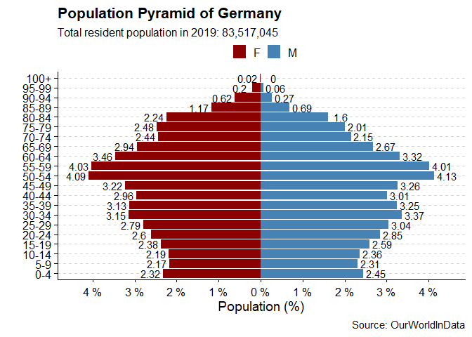
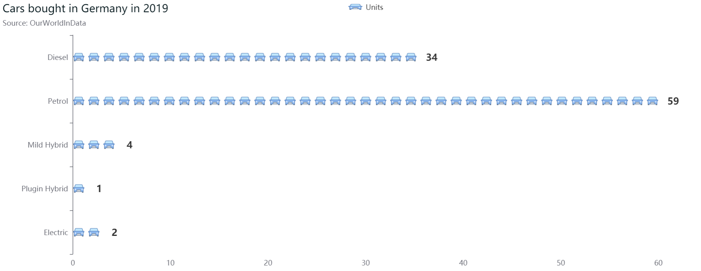
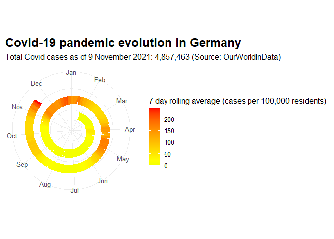

Germany - an overview
================
Mikel Tobar
9/11/2021

## Intro

In this document, we’ll create a visualization using R’s rCharts
package.

``` r
library(ggplot2)
library(tidyverse)
library(dplyr)
library(waffle)
library(ggthemes)
#remotes::install_github("JohnCoene/echarts4r.suite", force = TRUE)
#remotes::install_github('JohnCoene/echarts4r.assets', force= TRUE)
library(echarts4r)
library(echarts4r.assets)
```

## First visualization - pyramid charts

We’ll use a German population pyramid from 2019. The data can be
retrieved at <https://www.kaggle.com/hotessy/population-pyramid-2019>,
and several counntries can be found.

``` r
ger <-read.csv("Germany-2019.csv", TRUE, ",", fileEncoding = "UTF-8")
```

We’ll now handle the data.

``` r
ger <- ger%>%
  pivot_longer(names_to = 'Gender', values_to = 'Population', cols = 2:3) %>%
  mutate(PopPerc=case_when(Gender=='M'~round(Population/sum(Population)*100,2),
                           TRUE~-round(Population/sum(Population)*100,2)),
         signal=case_when(Gender=='M'~1,
                          TRUE~-1))
head(ger)
```

    ## # A tibble: 6 x 5
    ##   Age   Gender Population PopPerc signal
    ##   <chr> <chr>       <int>   <dbl>  <dbl>
    ## 1 0-4   M         2045919    2.45      1
    ## 2 0-4   F         1941523   -2.32     -1
    ## 3 5-9   M         1928580    2.31      1
    ## 4 5-9   F         1810893   -2.17     -1
    ## 5 10-14 M         1971230    2.36      1
    ## 6 10-14 F         1826839   -2.19     -1

``` r
levels(ger$Age)
```

    ## NULL

``` r
ger$Age <- factor(ger$Age,levels=unique(ger$Age),ordered=TRUE)
```

Let’s now plot it.

``` r
ggplot(ger)+
  geom_bar(aes(x=Age,y=PopPerc,fill=Gender),stat='identity')+
  geom_text(aes(x=Age,y=PopPerc+signal*.3,label=abs(PopPerc)))+
  coord_flip()+
  scale_fill_manual(name='',values=c('darkred','steelblue'))+
  scale_y_continuous(breaks=seq(-10,10,1),
                     labels=function(x){paste(abs(x),'%')})+
  labs(x='',y='Population (%)',
       title='Population Pyramid of Germany',
       subtitle=paste('Total resident population in 2019:', format(sum(ger$Population),big.mark=',')),
       caption='Source: OurWorldInData')+
  cowplot::theme_cowplot()+
  theme(axis.text.x=element_text(vjust=.5),
        panel.grid.major.y = element_line(color='lightgray',linetype='dashed'),
        legend.position = 'top',
        legend.justification = 'center')
```

<!-- -->

## Second visualization - isotype plot

We’ve studied the population of Germany in the 2019 year. But how are
this population’s patterns when it comes to buying cars? We have
downloaded some data from Our World In Data
(<https://ourworldindata.org/transport>) to study this patterns via an
isotype plot. First, let’s charge and manipulate the data.

``` r
#Charging the dataset
ger_cars <- read.csv("new-vehicles-type-area.csv", TRUE, ",", fileEncoding = "UTF-8")
ger_cars <- subset(ger_cars,ger_cars$Entity == "Germany")
row.names(ger_cars) <- ger_cars$Year

#Selecting columns
ger_cars <- ger_cars[ , 3:8 ]

#Rounding numbers
ger_cars <- ger_cars %>% 
  mutate_if(is.numeric, trunc)
```

Checking the sums of the cars sold by year would be helpful, so we can
estimate the representations.

``` r
#Checking absolute values
rowSums(ger_cars)
```

    ##    2001    2002    2003    2004    2005    2006    2007    2008    2009    2010 
    ## 3343209 3254340 3238521 3268682 3342712 3468494 3148584 3090297 3791573 2879799 
    ##    2011    2012    2013    2014    2015    2016    2017    2018    2019 
    ## 3175483 3084364 2954268 3038642 3207934 3353484 3443136 3437617 3609047

``` r
ger_cars$total <- rowSums(ger_cars)
```

We now can round the values knowing that every year, roughly between 2.8
and 3.5M cars have been sold. It’s time to get a simplified table for
our plots.

``` r
# Passing to percentaje
ger_cars <- ger_cars %>%
  mutate_at(c(2:6), funs(./ ger_cars$total*100)) %>%
  mutate_at(c(2:6), funs(round(.)))
```

    ## Warning: `funs()` was deprecated in dplyr 0.8.0.
    ## Please use a list of either functions or lambdas: 
    ## 
    ##   # Simple named list: 
    ##   list(mean = mean, median = median)
    ## 
    ##   # Auto named with `tibble::lst()`: 
    ##   tibble::lst(mean, median)
    ## 
    ##   # Using lambdas
    ##   list(~ mean(., trim = .2), ~ median(., na.rm = TRUE))
    ## This warning is displayed once every 8 hours.
    ## Call `lifecycle::last_lifecycle_warnings()` to see where this warning was generated.

We will now visualize how car buyers have bevahed the last recorded year
(2019).

``` r
cars_2019 <- ger_cars[19, c(2:6)]
cars_2019t <- t(cars_2019)
cars_2019t <- data.frame(cars_2019t)
cars_2019t <- tibble::rownames_to_column(cars_2019t, "x")
cars_2019t <- cars_2019t %>% 
  rename(
    Units = X2019
    )

cars_2019t[1, "x"] <- "Electric"
cars_2019t[2, "x"] <- "Plugin Hybrid"
cars_2019t[3, "x"] <- "Mild Hybrid"
cars_2019t[4, "x"] <- "Petrol"
cars_2019t[5, "x"] <- "Diesel"

car_icon <- "https://img.icons8.com/offices/30/000000/car.png"

cars_2019t %>% 
  e_charts(x) %>% 
  e_pictorial(Units, symbol = c(paste0("image://", car_icon)), 
              symbolRepeat = TRUE, z = -1,
              symbolSize = c(20, 20)) %>% 
  e_theme("london") %>%
  e_title("Cars bought in Germany in 2019", "Source: OurWorldInData") %>% 
  e_flip_coords() %>%
  # Hide Legend
  e_legend(show = TRUE) %>%
  # Remove Gridlines
  e_x_axis(splitLine=list(show = FALSE)) %>%
  e_y_axis(splitLine=list(show = FALSE)) %>%
  # Format Label
  e_labels(fontSize = 16, fontWeight ='bold', position = "right", offset=c(10, 0))
```

<!-- -->

## Third visualization - spyral plot

We have studied Germany’s population and car consumption patterns. Now,
we can study some Covid data. Does the German Coronavirus incidence give
any hints about seasonality patterns? We’ll download a dataset to find
out.

``` r
ger_covid <-read.csv("owid-covid-data.csv", TRUE, ",", fileEncoding = "UTF-8")
```

The data is quite big and we’ll transform it as we want to get some more
precise information.

``` r
ger_covid <- subset(ger_covid, ger_covid$location=="Germany")
ger_covid$rolling_population <- ger_covid$population/100000
ger_covid <- ger_covid %>%
  select(date, total_cases, rolling_population)

ger_covid <- cbind(roll = 0, ger_covid)
ger_covid <- cbind(week = 0, ger_covid)

rolling = ger_covid[1,"rolling_population"]
for(i in 8:nrow(ger_covid)) {       
  weekcases = ger_covid[i, "total_cases"] - ger_covid[i-7, "total_cases"]
  ger_covid[i, "week"] <- weekcases
  ger_covid[i, "roll"] <- weekcases/rolling }
```

We’ll plot the data to see the spiral of cases.

``` r
ger_plot <- data.frame(ger_covid$date, ger_covid$roll, day_num = 1:653)

for(i in 1:nrow(ger_plot)) {       
  ger_plot[i, "day_num"] <- ger_plot[i, "day_num"] + 365 + 27
  }

ggplot(ger_plot, aes(x= day_num %% 365, xend = day_num %% 365 + 2.5, y = day_num, yend = day_num, colour=ger_covid.roll)) + 
  geom_segment(size= 6) + 
  scale_y_continuous(limits=range(ger_covid$roll) + c(0,1000), labels = NULL) +
  scale_x_continuous(breaks = 30*0:11, minor_breaks = NULL, labels = month.abb) +
  scale_colour_gradient2(low="green", mid="yellow", high="red", midpoint=20) +
  coord_polar() + 
  theme_bw(base_size=12) + 
  labs(title='Covid-19 pandemic evolution in Germany',
       subtitle=paste('Total Covid cases as of 9 November 2021: 4,857,463', caption='(Source: OurWorldInData)'), x= NULL,y= NULL, color="7 day rolling average (cases per 100,000 residents)") +
  theme(axis.ticks.y = element_blank(), panel.border = element_blank(), plot.title = element_text(face="bold", size=18), panel.grid.minor.x=element_line(colour="grey60", size=10000))
```

<!-- -->

## Bibliography

1.  Our world in data: <https://ourworldindata.org/>

2.  Professional dataviz with ggplot2 (Sergio Costa):
    <https://github.com/sergiocostafh/ggplot2_dataviz>

3.  Listen data - create infographics with R:
    <https://www.listendata.com/2019/06/create-infographics-with-r.html>

4.  Stack Overflow - how to create a time spiral graph:
    <https://stackoverflow.com/questions/39480841/how-to-create-a-time-spiral-graph-using-r>

------------------------------------------------------------------------
